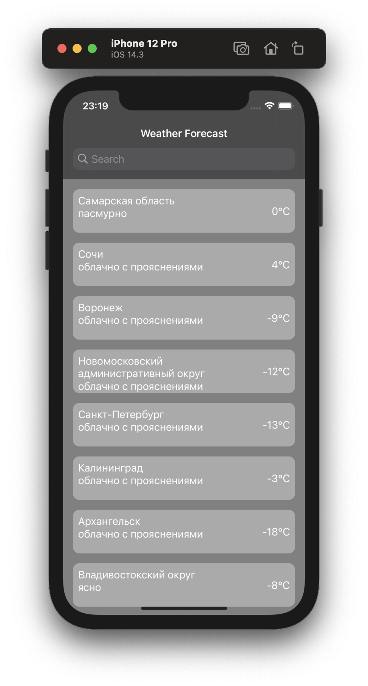
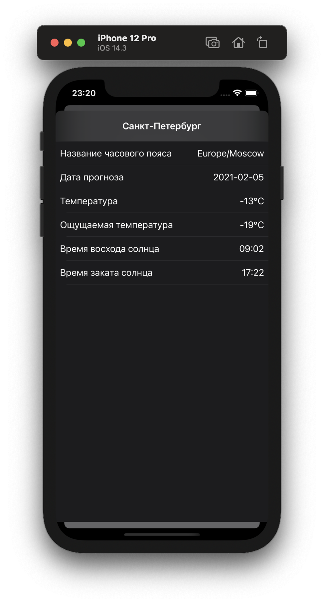
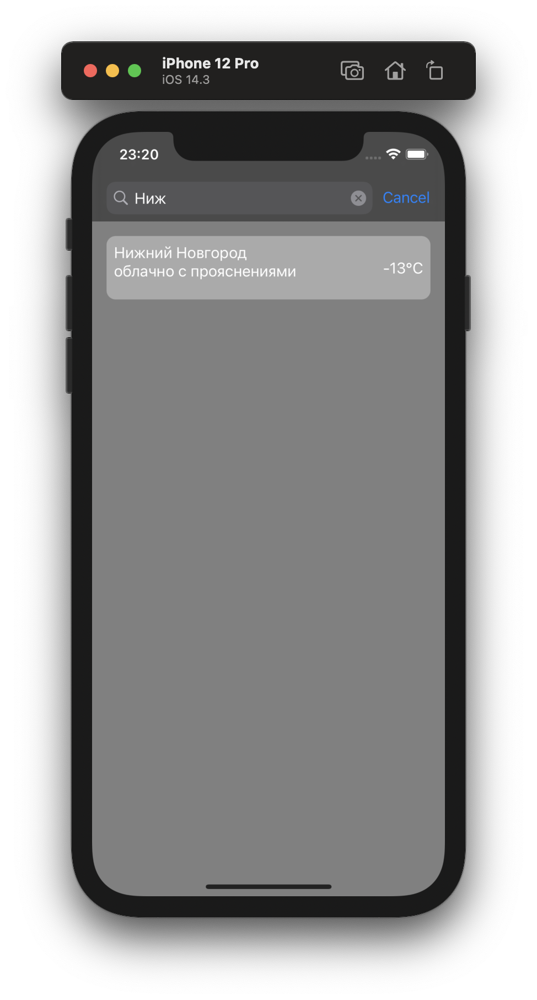

# WeatherForecast2.0
## Использованы технологии 

- UIKit
- SnapKit
- Swift Package Manager
- URLSession, JSONDecoder
- AutoLayout
- Compositional Layout
- Without Storyboard
- MVC

### Главный экран - погодные условия и температура для 10-ти городов.
> для погоды использован api Яндекса

### Детальная информация по выбранному городу.

### Фильтрация по городу.

